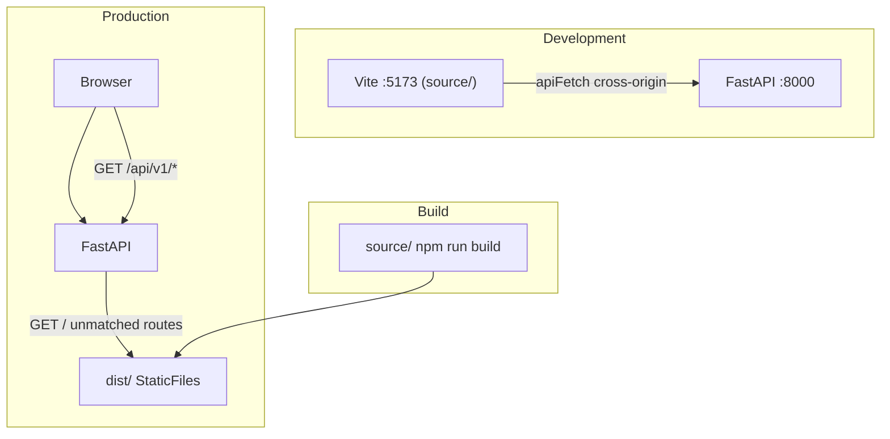

# AGENT.md — Default Storefront Frontend

Guide for AI agents and developers working on the Oshkelosh default storefront SPA.

## Quick rules

- Edit source in `source/` only — **never hand-edit `dist/`**
- Rebuild with `npm run build` (cwd: `source/`) to update `dist/`
- Use `$lib/api/*` for all backend calls — do not hardcode URLs
- Set `export const ssr = false` on every new route load module
- Do not duplicate site branding in frontend config — read from `data.config.site`
- Use Svelte 5 runes (`$props`, `$derived`, `$state`, `$effect`) — no legacy Svelte patterns
- When editing `.svelte` files, use the Svelte MCP server and svelte-code-writer / svelte-core-bestpractices skills
- Backend API contract: `curl -s http://localhost:8000/openapi.json`

---

## Architecture

The **Oshkelosh default storefront** is a SvelteKit 2 + Svelte 5 client-only SPA. Source lives in [`source/`](source/); the production build is written to [`dist/`](dist/). FastAPI serves `dist/` at `/` via a catch-all static handler with SPA fallback (`html=True`). Only **one** frontend addon can be active at a time; it is resolved per-request from DB config. In production, API calls use `/api/v1/*` on the same origin.



### Addon layout

```
app/addons/frontends/default/
├── AGENT.md          ← this file
├── addon.py          ← Python addon registration, points at dist/
├── routes.py         ← admin config UI
├── templates/        ← Jinja admin form
├── dist/             ← built SPA (generated)
└── source/           ← SvelteKit source (edit here)
    ├── package.json
    ├── svelte.config.js
    ├── vite.config.ts
    └── src/
        ├── routes/           ← file-based SvelteKit routes
        ├── lib/
        │   ├── api/          ← API client modules
        │   ├── components/   ← shared UI
        │   ├── types/        ← TypeScript interfaces
        │   └── utils/
        ├── app.html
        └── app.css
```

---

## Directory reference

| Path | Purpose |
|------|---------|
| [`source/src/routes/`](source/src/routes/) | SvelteKit file-based routes |
| [`source/src/lib/api/`](source/src/lib/api/) | API client (`config.ts`, `client.ts`, domain modules) |
| [`source/src/lib/components/`](source/src/lib/components/) | Shared UI components |
| [`source/src/lib/types/index.ts`](source/src/lib/types/index.ts) | TypeScript interfaces + `ApiError` |
| [`source/svelte.config.js`](source/svelte.config.js) | Build adapter → `../dist` |
| [`dist/`](dist/) | **Generated** — rebuild with `npm run build` |
| [`addon.py`](addon.py) | `DefaultFrontendAddon.get_static_directory()` → `dist/` |
| [`routes.py`](routes.py) | Admin config at `/admin/frontends/default` |
| [`../README.md`](../README.md) | Frontend-addon category docs |
| [`../../services/storefront_resolver.py`](../../services/storefront_resolver.py) | Resolves active frontend per request |
| [`../../../storefront/static.py`](../../../storefront/static.py) | `DynamicStorefrontStatic` catch-all mount |
| [`../../../addons/registry.py`](../../../addons/registry.py) | Addon discovery and registration |
| [`../../../main.py`](../../../main.py) | App factory; mounts SPA handler last |

---

## Tech stack

| Layer | Version / tool |
|-------|----------------|
| Svelte | 5.x (runes enforced project-wide) |
| SvelteKit | 2.x |
| Vite | 8.x |
| Adapter | `@sveltejs/adapter-static` (SPA fallback) |
| TypeScript | 6.x |
| Runtime npm deps | None (all devDependencies) |

### Conventions

- **CSR only**: every route load module exports `export const ssr = false`
- **No custom Svelte stores** — state via SvelteKit `load()` + runes; only `$app/stores` `page` in search/pagination
- **No SSR / prerender**
- **No frontend tests** in `source/` currently
- **Svelte 5 runes** enforced in [`source/svelte.config.js`](source/svelte.config.js) via `compilerOptions.runes`

---

## Development workflow

### Prerequisites

1. Backend running at `http://127.0.0.1:8000`:
   ```bash
   # from repo root (oshkelosh_fastapi/)
   ./scripts/run_dev.sh
   ```
2. Frontend addon enabled at `/admin/frontends/default`

### Commands

Run from `source/`:

```bash
npm install
npm run dev      # http://localhost:5173
npm run build    # writes to ../dist/
npm run check    # svelte-check type validation
```

### Dual-server dev model

| | Dev server | Production |
|---|------------|------------|
| SPA | Vite on `:5173` | FastAPI serves `dist/` at `/` |
| API | `http://127.0.0.1:8000` | Same origin `/api/v1/*` |
| CORS | Required | Not needed |

- Vite dev server on `:5173`; API calls go directly to `:8000` via [`getApiBase()`](source/src/lib/api/config.ts)
- **No Vite proxy** — cross-origin fetch in dev
- **CORS required**: backend `CORS_ORIGINS` must include `http://localhost:5173` and `http://127.0.0.1:5173` (not in default `.env.example` — add manually)
- Optional override: `VITE_API_BASE_URL` at build/dev time

### OpenAPI

Use the backend OpenAPI spec as the source of truth for endpoints, schemas, and types:

```bash
curl -s http://localhost:8000/openapi.json
```

Interactive docs: `http://localhost:8000/docs` (when `DEBUG=true`)

---

## Production / integrated workflow

1. `cd source && npm run build` → outputs to [`../dist/`](../dist/) per [`svelte.config.js`](source/svelte.config.js):
   - `adapter-static` with `fallback: 'index.html'`, `strict: false`
   - Base URL: `""` (root `/`) — assets at `/_app/immutable/...`
2. Reload browser (server reads from disk per request; restart only if needed)
3. Enable addon at `/admin/frontends/default` if not active
4. Browse `http://localhost:8000/` — same-origin API

Build output structure:

```
dist/
├── index.html
├── robots.txt
└── _app/immutable/   # hashed JS/CSS chunks
```

---

## FastAPI integration

### How the SPA is served

1. **Addon discovery** at import/startup: [`app/addons/registry.py`](../../../addons/registry.py)
2. **Static serving**: [`register_storefront_handler(app)`](../../../main.py) mounts `DynamicStorefrontStatic` at `/` **last** (after `/api/v1`, `/admin`, setup, media, health)
3. **Per-request resolution**: [`storefront_resolver.py`](../../services/storefront_resolver.py) picks the enabled frontend addon and its `dist/` directory
4. **SPA fallback**: Starlette `StaticFiles(html=True)` — unknown paths serve `index.html`
5. **503 when disabled**: no enabled frontend → unavailable HTML or config 503

### Admin configuration

| URL | Purpose |
|-----|---------|
| `/admin/frontends/default` | Frontend-specific options (layout, pagination, nav) |
| `/admin/settings` | Site-wide branding (name, logo, colors, fonts) |
| `/admin/addons` | Enable/disable frontend addons |

Frontend-specific options ([`DefaultFrontendConfig`](addon.py)):

- `layout`: `"grid"` | `"list"`
- `products_per_page`: 1–100 (default 12)
- `show_category_nav`: boolean (default true)

### Switching frontends

- Enable/disable in admin takes effect **immediately** (no restart)
- **New addon packages** require server restart (discovery runs at startup)
- Legacy fallback: repo-root `frontend/dist/` if no addon enabled (deprecated)

---

## Storefront bootstrap contract

Every page load follows this sequence (see [`+layout.svelte`](source/src/routes/+layout.svelte), [`storefront.ts`](source/src/lib/api/storefront.ts)):

1. Load theme CSS: `GET /api/v1/storefront/theme.css`
2. Fetch config: `GET /api/v1/storefront/config` → `{ site, frontend }`
3. Apply branding via CSS variables (`--color-primary`, `--color-secondary`, `--font-sans`) and `<title>`, favicon, meta
4. On 503: fall back to defaults + show `configUnavailable` banner

### Config layers

Do **not** duplicate site branding in frontend config.

| Layer | Admin UI | SPA access |
|-------|----------|------------|
| `site.*` | `/admin/settings` | `data.config.site` |
| `frontend.config.*` | `/admin/frontends/default` | `data.config.frontend.config` |

Layout [`+layout.ts`](source/src/routes/+layout.ts) loads config + categories once; child routes use `parent()` for settings like `products_per_page`.

---

## API client patterns

### Layer stack

```
config.ts (getApiBase, apiUrl)
  → client.ts (apiFetch, throws ApiError)
    → storefront.ts | products.ts | categories.ts
      → route +page.ts load() functions
```

### Base URL ([`config.ts`](source/src/lib/api/config.ts))

| Environment | API base |
|-------------|----------|
| Dev (default) | `http://127.0.0.1:8000` |
| Dev (`VITE_API_BASE_URL`) | Override |
| Production build | `''` (same-origin) |

### Endpoints currently used

| Module | Endpoint |
|--------|----------|
| storefront | `GET /api/v1/storefront/config` |
| layout | `GET /api/v1/storefront/theme.css` |
| products | `GET /api/v1/products`, `GET /api/v1/products/{id}` |
| categories | `GET /api/v1/categories`, `GET /api/v1/categories/{slug}` |
| product utils | `GET /api/v1/media/{key}` |

### Error handling

- `apiFetch` throws `ApiError` with status and message (parses FastAPI `detail` / `message`)
- Route `load()` catches errors, returns `{ error: message }` or calls SvelteKit `error(404)`
- UI: `ErrorState` component + `invalidateAll()` for retry
- Product list normalization: API may return `items` or `products` — handled in [`products.ts`](source/src/lib/api/products.ts)

### Adding new API calls

1. Add types to [`source/src/lib/types/index.ts`](source/src/lib/types/index.ts)
2. Add domain function in `source/src/lib/api/`
3. Call from route `+page.ts` `load()` — not from components directly when possible

---

## Routing

| Route | Load data | Notes |
|-------|-----------|-------|
| `/` | Featured products (page_size 8) | Home |
| `/products` | Paginated catalog | URL params: `page`, `search`, `sort`, `order` |
| `/products/[id]` | Single product | 404 on missing |
| `/categories` | Category tree | |
| `/categories/[slug]` | Category + products | Pagination |

### Navigation

- Links: `$app/paths` `resolve()`
- Programmatic: `$app/navigation` `goto()`
- Query params preserved for search/pagination

### Adding a new route

1. Create `source/src/routes/your-route/+page.ts` with `export const ssr = false` and a `load()` function
2. Create `source/src/routes/your-route/+page.svelte`
3. Use existing components from `lib/components/` where possible
4. Fetch data in `load()`, not in component `onMount`

---

## Styling

- Global styles: [`source/src/app.css`](source/src/app.css)
- Theme overrides from backend via CSS variables (also set in layout `$effect`)
- Standard variables: `--color-primary`, `--color-secondary`, `--font-sans`
- Layout classes: `layout-grid` / `layout-list` driven by frontend config
- Reuse components in `lib/components/` before adding new ones

Existing components:

| Component | Purpose |
|-----------|---------|
| `Header.svelte` | Site header, logo, nav |
| `Footer.svelte` | Site footer |
| `CategoryNav.svelte` | Category navigation |
| `SearchBar.svelte` | Product search |
| `Pagination.svelte` | Page navigation |
| `ProductCard.svelte` | Product list item |
| `ProductGrid.svelte` | Product grid/list layout |
| `EmptyState.svelte` | Empty results |
| `ErrorState.svelte` | Error with retry |

---

## Not implemented yet

Scope boundaries — do not assume these exist in the SPA:

- Auth (login, register, JWT storage)
- Cart, checkout, order flows (APIs exist on backend)
- Custom stores or global state management
- SSR / prerender
- Frontend tests

Backend APIs for future work are documented in [`../README.md`](../README.md) (auth, cart, orders, checkout).

---

## Common pitfalls

| Symptom | Likely cause |
|---------|--------------|
| 503 / default branding | Frontend addon disabled — enable at `/admin/frontends/default` |
| API calls fail from `:5173` | Missing CORS origins in backend `.env` |
| SPA 404 on refresh in prod | `dist/index.html` missing — run `npm run build` |
| Changes not visible in prod | Edited `dist/` directly — rebuild from `source/` |
| Wrong API URL in prod | Hardcoded origin — use `$lib/api/config` |
| Type errors after route change | Run `npm run check` |

---

## Related documentation

- [`source/README.md`](source/README.md) — quick dev/build guide
- [`../README.md`](../README.md) — frontend addon category, bootstrap contract, CSS variables
- [`../../../addons/README.md`](../../../addons/README.md) — general addon system
- Backend OpenAPI: `http://localhost:8000/docs`
